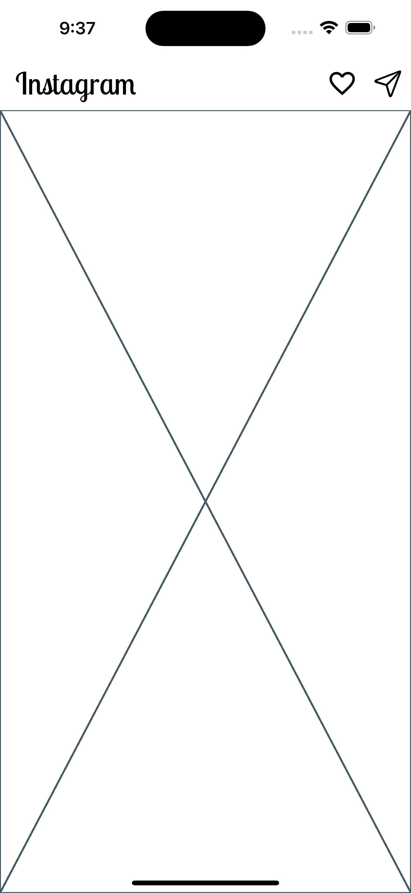

# 인스타그램 UI 구현해보기

## 과정 엿보기 👀

### 1. 앱바

핵심 개념 
- AppBar

<br/>



<br/>

<details>
<summary>핵심 코드</summary>
<div markdown="1">

```dart
import 'package:flutter/cupertino.dart';
import 'package:flutter/material.dart';
import 'package:google_fonts/google_fonts.dart';

void main() {
  runApp(const InstagramApp());
}

class InstagramApp extends StatelessWidget {
  const InstagramApp({super.key});

  @override
  Widget build(BuildContext context) {
    return MaterialApp(
      debugShowCheckedModeBanner: false,
      theme: ThemeData(
        colorScheme: const ColorScheme.light(
          primary: Colors.white,
          secondary: Colors.black,
        ),
        useMaterial3: true,
      ),
      home: const InstagramHome(),
    );
  }
}

class InstagramHome extends StatelessWidget {
  const InstagramHome({super.key});

  @override
  Widget build(BuildContext context) {
    return Scaffold(
      appBar: AppBar(
        centerTitle: false,
        title: Text(
          "Instagram",
          style: GoogleFonts.lobsterTwo(
            color: Colors.black,
            fontSize: 32,
          ),
        ),
        actions: [
          IconButton(
            onPressed: () {},
            icon: const Icon(
              Icons.favorite_outline,
              size: 32,
            ),
          ),
          IconButton(
            onPressed: () {},
            icon: const Icon(
              CupertinoIcons.paperplane,
              size: 32,
            ),
          ),
        ],
      ),
      body: const Placeholder(),
    );
  }
}
```

</div>
</details>

<br/>

### 3. 하단 네비게이션 바

핵심 개념
- BottomNavigationBar

<br/>


<br/>

<details>
<summary>핵심 코드</summary>
<div markdown="1">

```dart
import 'package:flutter/cupertino.dart';
import 'package:flutter/material.dart';
import 'package:google_fonts/google_fonts.dart';
import 'package:instagram/body.dart';

void main() {
  runApp(const InstagramApp());
}

class InstagramApp extends StatelessWidget {
  const InstagramApp({super.key});

  @override
  Widget build(BuildContext context) {
    return MaterialApp(
      debugShowCheckedModeBanner: false,
      theme: ThemeData(
        colorScheme: const ColorScheme.light(
          primary: Colors.white,
          secondary: Colors.black,
        ),
        bottomNavigationBarTheme: const BottomNavigationBarThemeData(
          showSelectedLabels: false,
          showUnselectedLabels: false,
          selectedItemColor: Colors.black,
        ),
        useMaterial3: true,
      ),
      home: const InstagramHome(),
    );
  }
}

class InstagramHome extends StatefulWidget {
  const InstagramHome({super.key});

  @override
  State<InstagramHome> createState() => _InstagramHomeState();
}

class _InstagramHomeState extends State<InstagramHome> {
  late int index;

  @override
  void initState() {
    // TODO: implement initState
    super.initState();
    index = 0;
  }

  @override
  Widget build(BuildContext context) {
    return Scaffold(
      appBar: AppBar(
        centerTitle: false,
        title: Text(
          "Instagram",
          style: GoogleFonts.lobsterTwo(
            color: Colors.black,
            fontSize: 32,
          ),
        ),
        actions: [
          IconButton(
            onPressed: () {},
            icon: const Icon(
              Icons.favorite_outline,
              size: 32,
            ),
          ),
          IconButton(
            onPressed: () {},
            icon: const Icon(
              CupertinoIcons.paperplane,
              size: 32,
            ),
          ),
        ],
      ),
      body: InstagramBody(index: index),
      bottomNavigationBar: BottomNavigationBar(
        onTap: (newIndex) => setState(() => index = newIndex),
        currentIndex: index,
        items: const [
          BottomNavigationBarItem(
            icon: Icon(
              Icons.home,
              size: 28,
            ),
            label: 'Home',
          ),
          BottomNavigationBarItem(
            icon: Icon(
              Icons.search,
              size: 28,
            ),
            label: 'Search',
          ),
        ],
      ),
    );
  }
}
```

</div>
</details>

<br/>

<details>
<summary>핵심 코드</summary>
<div markdown="1">

```dart
import 'package:flutter/material.dart';
import 'package:instagram/screen/home_screen.dart';
import 'package:instagram/screen/search_screen.dart';

class InstagramBody extends StatelessWidget {
  final int index;

  const InstagramBody({required this.index, super.key});

  @override
  Widget build(BuildContext context) {
    if (index == 1) {
      return const SearchScreen();
    }

    return const HomeScreen();
  }
}

```

</div>
</details>

<br/>

<br/>
<br/>

## 결과 엿보기 👀