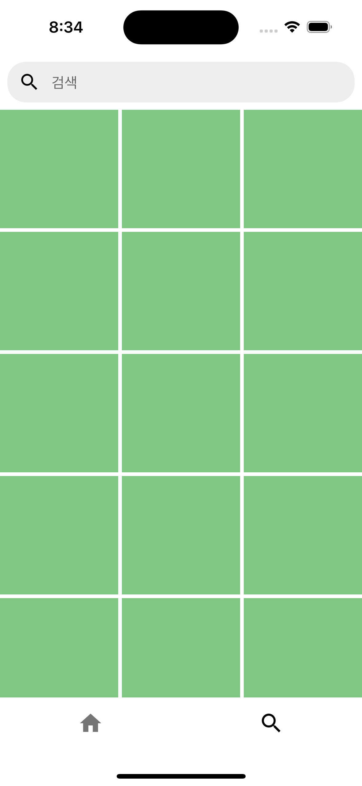

# 인스타그램 UI 구현해보기

## 과정 엿보기 👀

### 1. 앱바

핵심 개념 
- AppBar

<br/>


<br/>

<details>
<summary>핵심 코드</summary>
<div markdown="1">

```dart
import 'package:flutter/cupertino.dart';
import 'package:flutter/material.dart';
import 'package:google_fonts/google_fonts.dart';

void main() {
  runApp(const InstagramApp());
}

class InstagramApp extends StatelessWidget {
  const InstagramApp({super.key});

  @override
  Widget build(BuildContext context) {
    return MaterialApp(
      debugShowCheckedModeBanner: false,
      theme: ThemeData(
        colorScheme: const ColorScheme.light(
          primary: Colors.white,
          secondary: Colors.black,
        ),
        useMaterial3: true,
      ),
      home: const InstagramHome(),
    );
  }
}

class InstagramHome extends StatelessWidget {
  const InstagramHome({super.key});

  @override
  Widget build(BuildContext context) {
    return Scaffold(
      appBar: AppBar(
        centerTitle: false,
        title: Text(
          "Instagram",
          style: GoogleFonts.lobsterTwo(
            color: Colors.black,
            fontSize: 32,
          ),
        ),
        actions: [
          IconButton(
            onPressed: () {},
            icon: const Icon(
              Icons.favorite_outline,
              size: 32,
            ),
          ),
          IconButton(
            onPressed: () {},
            icon: const Icon(
              CupertinoIcons.paperplane,
              size: 32,
            ),
          ),
        ],
      ),
      body: const Placeholder(),
    );
  }
}
```

</div>
</details>

<br/>

### 2. 하단 네비게이션 바

핵심 개념
- BottomNavigationBar

<br/>


<br/>

<details>
<summary>핵심 코드</summary>
<div markdown="1">

```dart
import 'package:flutter/cupertino.dart';
import 'package:flutter/material.dart';
import 'package:google_fonts/google_fonts.dart';
import 'package:instagram/body.dart';

void main() {
  runApp(const InstagramApp());
}

class InstagramApp extends StatelessWidget {
  const InstagramApp({super.key});

  @override
  Widget build(BuildContext context) {
    return MaterialApp(
      debugShowCheckedModeBanner: false,
      theme: ThemeData(
        colorScheme: const ColorScheme.light(
          primary: Colors.white,
          secondary: Colors.black,
        ),
        bottomNavigationBarTheme: const BottomNavigationBarThemeData(
          showSelectedLabels: false,
          showUnselectedLabels: false,
          selectedItemColor: Colors.black,
        ),
        useMaterial3: true,
      ),
      home: const InstagramHome(),
    );
  }
}

class InstagramHome extends StatefulWidget {
  const InstagramHome({super.key});

  @override
  State<InstagramHome> createState() => _InstagramHomeState();
}

class _InstagramHomeState extends State<InstagramHome> {
  late int index;

  @override
  void initState() {
    // TODO: implement initState
    super.initState();
    index = 0;
  }

  @override
  Widget build(BuildContext context) {
    return Scaffold(
      appBar: AppBar(
        centerTitle: false,
        title: Text(
          "Instagram",
          style: GoogleFonts.lobsterTwo(
            color: Colors.black,
            fontSize: 32,
          ),
        ),
        actions: [
          IconButton(
            onPressed: () {},
            icon: const Icon(
              Icons.favorite_outline,
              size: 32,
            ),
          ),
          IconButton(
            onPressed: () {},
            icon: const Icon(
              CupertinoIcons.paperplane,
              size: 32,
            ),
          ),
        ],
      ),
      body: InstagramBody(index: index),
      bottomNavigationBar: BottomNavigationBar(
        onTap: (newIndex) => setState(() => index = newIndex),
        currentIndex: index,
        items: const [
          BottomNavigationBarItem(
            icon: Icon(
              Icons.home,
              size: 28,
            ),
            label: 'Home',
          ),
          BottomNavigationBarItem(
            icon: Icon(
              Icons.search,
              size: 28,
            ),
            label: 'Search',
          ),
        ],
      ),
    );
  }
}
```

</div>
</details>

<br/>

<details>
<summary>핵심 코드</summary>
<div markdown="1">

```dart
import 'package:flutter/material.dart';
import 'package:instagram/screen/home_screen.dart';
import 'package:instagram/screen/search_screen.dart';

class InstagramBody extends StatelessWidget {
  final int index;

  const InstagramBody({required this.index, super.key});

  @override
  Widget build(BuildContext context) {
    if (index == 1) {
      return const SearchScreen();
    }

    return const HomeScreen();
  }
}

```

</div>
</details>

<br/>

### 3. 홈 화면

핵심 개념
- SingleChildScrollView
- ListView

<br/>


<br/>

<details>
<summary>핵심 코드</summary>
<div markdown="1">

```dart
import 'package:flutter/cupertino.dart';
import 'package:flutter/material.dart';

class HomeScreen extends StatelessWidget {
  const HomeScreen({super.key});

  @override
  Widget build(BuildContext context) {
    return const SingleChildScrollView(
      child: Column(
        children: [
          StoryList(),
          FeedList(),
        ],
      ),
    );
  }
}

class StoryList extends StatelessWidget {
  const StoryList({super.key});

  @override
  Widget build(BuildContext context) {
    return SingleChildScrollView(
      scrollDirection: Axis.horizontal,
      child: Row(
        children: List.generate(
          10,
          (index) => UserStory(
            userName: "User $index",
          ),
        ),
      ),
    );
  }
}

class UserStory extends StatelessWidget {
  final String userName;

  const UserStory({
    super.key,
    required this.userName,
  });

  @override
  Widget build(BuildContext context) {
    return Padding(
      padding: const EdgeInsets.symmetric(vertical: 12, horizontal: 8),
      child: Column(
        children: [
          Container(
            width: 60,
            height: 60,
            margin: const EdgeInsets.symmetric(vertical: 4, horizontal: 8),
            decoration: BoxDecoration(
              color: Colors.blue.shade300,
              borderRadius: BorderRadius.circular(30),
            ),
          ),
          Text(userName),
        ],
      ),
    );
  }
}

class FeedData {
  final String userName;
  final int likeCount;
  final String content;

  FeedData({
    required this.userName,
    required this.likeCount,
    required this.content,
  });
}

final feedDataList = [
  FeedData(userName: "User 0", likeCount: 12, content: "User 0 Text!"),
  FeedData(userName: "User 1", likeCount: 11, content: "User 1 Text!"),
  FeedData(userName: "User 2", likeCount: 13, content: "User 2 Text!"),
  FeedData(userName: "User 3", likeCount: 10, content: "User 3 Text!"),
  FeedData(userName: "User 4", likeCount: 28, content: "User 4 Text!"),
  FeedData(userName: "User 5", likeCount: 33, content: "User 5 Text!"),
  FeedData(userName: "User 6", likeCount: 7, content: "User 6 Text!"),
  FeedData(userName: "User 7", likeCount: 32, content: "User 7 Text!"),
  FeedData(userName: "User 8", likeCount: 6, content: "User 8 Text!"),
  FeedData(userName: "User 9", likeCount: 19, content: "User 9 Text!"),
];

class FeedList extends StatelessWidget {
  const FeedList({super.key});

  @override
  Widget build(BuildContext context) {
    return ListView.builder(
      shrinkWrap: true,
      physics: const NeverScrollableScrollPhysics(),
      itemCount: feedDataList.length,
      itemBuilder: (context, index) => FeedItem(feedData: feedDataList[index]),
    );
  }
}

class FeedItem extends StatelessWidget {
  final FeedData feedData;

  const FeedItem({
    super.key,
    required this.feedData,
  });

  @override
  Widget build(BuildContext context) {
    return Column(
      crossAxisAlignment: CrossAxisAlignment.start,
      children: [
        Padding(
          padding: const EdgeInsets.symmetric(vertical: 4, horizontal: 12),
          child: Row(
            mainAxisAlignment: MainAxisAlignment.spaceBetween,
            children: [
              Row(
                children: [
                  Container(
                    height: 40,
                    width: 40,
                    decoration: BoxDecoration(
                      borderRadius: BorderRadius.circular(20),
                      color: Colors.blue.shade300,
                    ),
                  ),
                  const SizedBox(width: 8),
                  Text(feedData.userName),
                ],
              ),
              const Icon(Icons.more_vert),
            ],
          ),
        ),
        const SizedBox(height: 8),
        Container(
          width: double.infinity,
          height: 300,
          color: Colors.indigo.shade300,
        ),
        Padding(
          padding: const EdgeInsets.only(left: 12, right: 12, top: 4),
          child: Row(
            mainAxisAlignment: MainAxisAlignment.spaceBetween,
            children: [
              Row(
                children: [
                  IconButton(
                      onPressed: () {},
                      icon: const Icon(Icons.favorite_outline)),
                  IconButton(
                      onPressed: () {},
                      icon: const Icon(CupertinoIcons.chat_bubble)),
                  IconButton(
                      onPressed: () {},
                      icon: const Icon(CupertinoIcons.paperplane)),
                ],
              ),
              IconButton(
                  onPressed: () {}, icon: const Icon(CupertinoIcons.bookmark)),
            ],
          ),
        ),
        Padding(
          padding: const EdgeInsets.symmetric(horizontal: 24),
          child: Text(
            "좋아요 ${feedData.likeCount}개",
            style: const TextStyle(
              fontWeight: FontWeight.bold,
            ),
          ),
        ),
        Padding(
          padding: const EdgeInsets.symmetric(horizontal: 24, vertical: 4),
          child: RichText(
            text: TextSpan(
              children: [
                TextSpan(
                  text: feedData.userName,
                  style: const TextStyle(
                    fontWeight: FontWeight.bold,
                  ),
                ),
                const TextSpan(text: " "),
                TextSpan(text: feedData.content),
              ],
              style: const TextStyle(color: Colors.black),
            ),
          ),
        ),
        const SizedBox(height: 12),
      ],
    );
  }
}
```

</div>
</details>

<br/>

### 4. 검색 화면

핵심 개념 
- TextField
- GridView

<br/>



<br/>

<details>
<summary>핵심 코드</summary>
<div markdown="1">

```dart
import 'package:flutter/material.dart';

class SearchScreen extends StatelessWidget {
  const SearchScreen({super.key});

  @override
  Widget build(BuildContext context) {
    return const SafeArea(
      child: SingleChildScrollView(
        child: Column(
          children: [
            SearchTextBar(),
            SearchGrid(),
          ],
        ),
      ),
    );
  }
}

class SearchTextBar extends StatelessWidget {
  const SearchTextBar({super.key});

  @override
  Widget build(BuildContext context) {
    return SizedBox(
      height: 60,
      child: Padding(
        padding: const EdgeInsets.all(8.0),
        child: TextField(
          cursorColor: Colors.black,
          decoration: InputDecoration(
            prefixIcon: const Icon(Icons.search),
            hintText: '검색',
            border: OutlineInputBorder(
              borderRadius: BorderRadius.circular(20),
              borderSide: BorderSide(
                color: Colors.grey.shade200,
                width: 1,
              ),
            ),
            contentPadding: const EdgeInsets.all(0),
            filled: true,
            fillColor: Colors.grey.shade200,
            enabledBorder: OutlineInputBorder(
              borderRadius: BorderRadius.circular(20),
              borderSide: BorderSide(
                color: Colors.grey.shade200,
                width: 1,
              ),
            ),
          ),
        ),
      ),
    );
  }
}

final girdItems = List.generate(30, (index) => Colors.green.shade300);

class SearchGrid extends StatelessWidget {
  const SearchGrid({super.key});

  @override
  Widget build(BuildContext context) {
    return GridView.count(
      mainAxisSpacing: 4,
      crossAxisSpacing: 4,
      crossAxisCount: 3,
      shrinkWrap: true,
      physics: const NeverScrollableScrollPhysics(),
      padding: EdgeInsets.zero,
      children: girdItems.map((color) => Container(color: color)).toList(),
    );
  }
}
```

</div>
</details>

<br/>
<br/>

## 결과 엿보기 👀