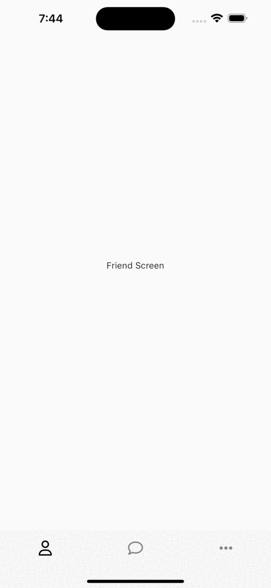
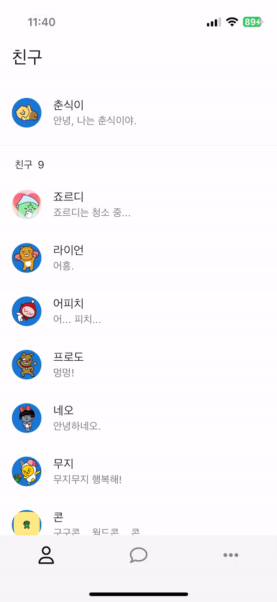
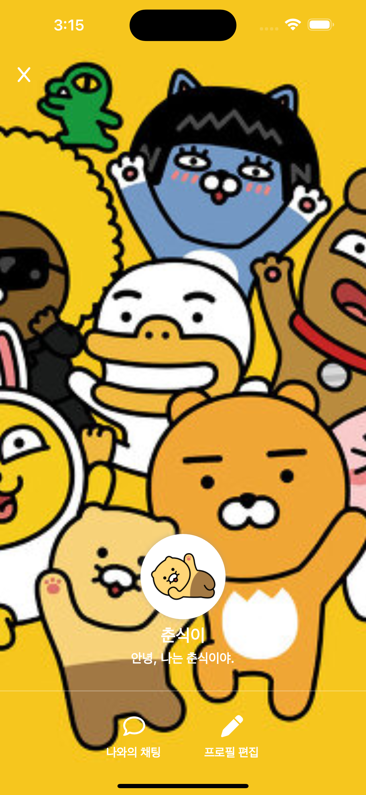
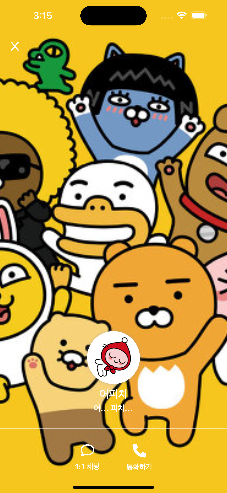
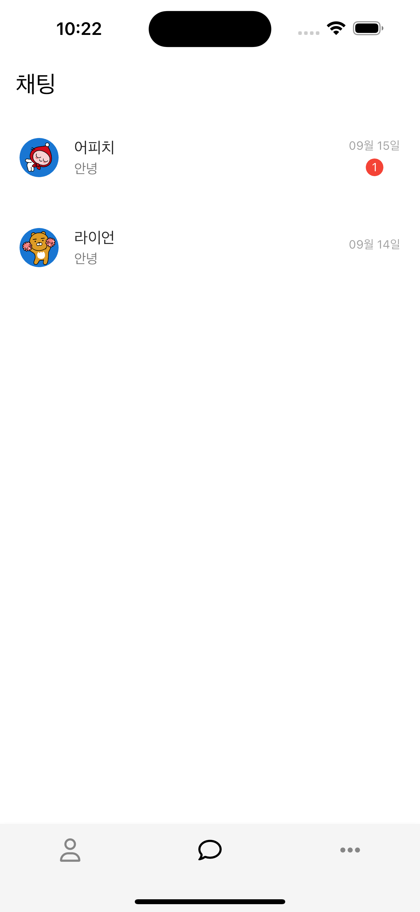
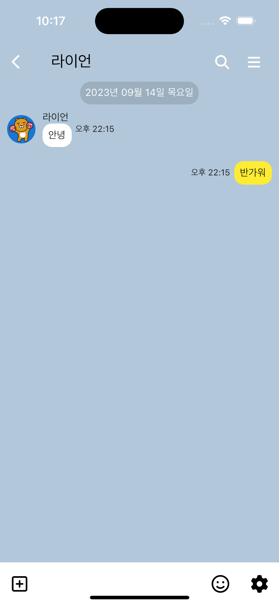
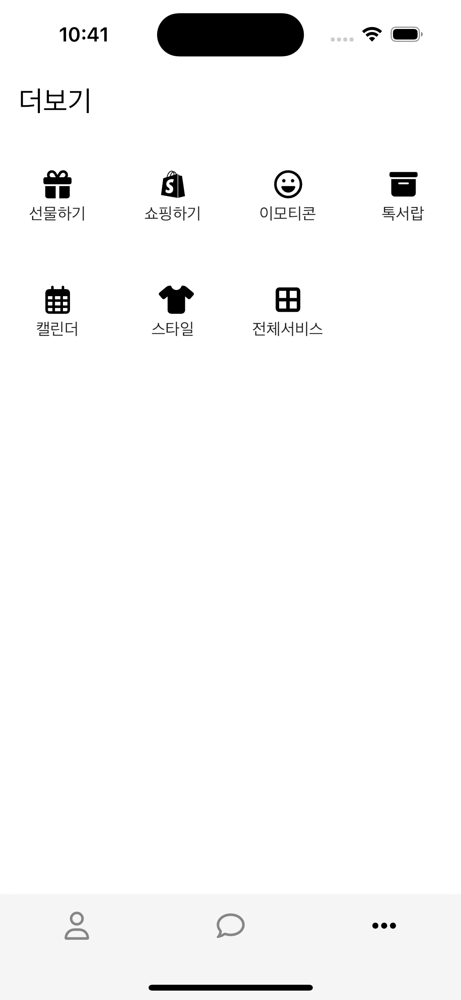

# 카카오톡 UI 구현해보기

## 과정 엿보기 👀

### 1. 홈 화면

핵심 개념 
- IndexedStack 
- BottomNavigationBar

<br/>



<br/>

<details>
<summary>핵심 코드</summary>
<div markdown="1">

```dart
import 'package:flutter/material.dart';
import 'package:font_awesome_flutter/font_awesome_flutter.dart';
import 'package:kakaotalk/screens/chat_screen.dart';
import 'package:kakaotalk/screens/friend_screen.dart';
import 'package:kakaotalk/screens/more_screen.dart';

class MainScreen extends StatefulWidget {
  const MainScreen({super.key});

  @override
  State<MainScreen> createState() => _MainScreenState();
}

class _MainScreenState extends State<MainScreen> {
  late int selectedIndex;

  @override
  void initState() {
    // TODO: implement initState
    super.initState();
    selectedIndex = 0;
  }

  @override
  Widget build(BuildContext context) {
    return Scaffold(
      body: IndexedStack(
        index: selectedIndex,
        children: const [
          FriendScreen(),
          ChatScreen(),
          MoreScreen(),
        ],
      ),
      bottomNavigationBar: BottomNavigationBar(
        showSelectedLabels: false,
        showUnselectedLabels: false,
        currentIndex: selectedIndex,
        backgroundColor: Colors.grey.shade100,
        selectedItemColor: Colors.black,
        unselectedItemColor: Colors.black45,
        onTap: (index) => setState(() {
          selectedIndex = index;
        }),
        items: const [
          BottomNavigationBarItem(
            icon: Icon(FontAwesomeIcons.user),
            label: "Friend",
          ),
          BottomNavigationBarItem(
            icon: Icon(FontAwesomeIcons.comment),
            label: "Chat",
          ),
          BottomNavigationBarItem(
            icon: Icon(FontAwesomeIcons.ellipsis),
            label: "More",
          ),
        ],
      ),
    );
  }
}

```

</div>
</details>

<br/>

### 2. 친구 리스트

핵심 개념
- ListView
- ListTile

<br/>



<br/>

<details>
<summary>핵심 코드</summary>
<div markdown="1">

```dart

import 'package:flutter/material.dart';
import 'package:kakaotalk/components/profile_card.dart';
import 'package:kakaotalk/models/user.dart';

class FriendScreen extends StatelessWidget {
  const FriendScreen({super.key});

  @override
  Widget build(BuildContext context) {
    return Scaffold(
      backgroundColor: Colors.white,
      appBar: AppBar(
        title: const Text("친구"),
      ),
      body: Column(
        children: [
          const SizedBox(height: 10),
          ProfileCard(user: me),
          const Divider(),
          Padding(
            padding: const EdgeInsets.symmetric(horizontal: 20, vertical: 10),
            child: Row(
              children: [
                const Text("친구"),
                const SizedBox(width: 6),
                Text("${friends.length}"),
              ],
            ),
          ),
          Expanded(
            child: ListView(
              children: List.generate(
                friends.length,
                (index) => ProfileCard(user: friends[index]),
              ),
            ),
          ),
        ],
      ),
    );
  }
}

```

</div>
</details>

<details>
<summary>핵심 코드</summary>
<div markdown="1">

```dart

import 'package:flutter/material.dart';
import 'package:kakaotalk/models/user.dart';

class ProfileCard extends StatelessWidget {
  final User user;

  const ProfileCard({required this.user, super.key});

  @override
  Widget build(BuildContext context) {
    return ListTile(
      leading: CircleAvatar(
        backgroundImage: AssetImage(user.backgroundImage),
      ),
      title: Text(user.name),
      subtitle: Text(user.info),
    );
  }
}

```

</div>
</details>

<br/>

### 3. 프로필 화면

핵심 개념 
- InkWell
- Navigator

<br/>

<p align="left">
    
    
<p>

<br/>

<details>
<summary>핵심 코드</summary>
<div markdown="1">

```dart

import 'package:flutter/material.dart';
import 'package:kakaotalk/models/user.dart';
import 'package:kakaotalk/screens/profile_screen.dart';

class ProfileCard extends StatelessWidget {
  final User user;

  const ProfileCard({required this.user, super.key});

  @override
  Widget build(BuildContext context) {
    return InkWell(
      onTap: () {
        Navigator.push(
          context,
          MaterialPageRoute(
            builder: (context) => ProfileScreen(user: user),
          ),
        );
      },
      child: ListTile(
        leading: CircleAvatar(
          backgroundImage: AssetImage(user.profileImage),
        ),
        title: Text(user.name),
        subtitle: Text(user.info),
      ),
    );
  }
}

```

</div>
</details>

<details>
<summary>핵심 코드</summary>
<div markdown="1">

```dart

appBar: AppBar(
          backgroundColor: Colors.transparent,
          leading: IconButton(
            icon: const Icon(
              FontAwesomeIcons.x,
              size: 20,
              color: Colors.white,
            ),
            onPressed: () => Navigator.pop(context),
          ),
        ),

```

</div>
</details>

<br/>

### 4. 채팅 리스트

핵심 개념
- ListView
- ListTile

<br/>



<br/>

<details>
<summary>핵심 코드</summary>
<div markdown="1">

```dart

import 'package:flutter/material.dart';
import 'package:kakaotalk/components/chat_card.dart';
import 'package:kakaotalk/models/chat.dart';

class ChatScreen extends StatelessWidget {
  const ChatScreen({super.key});

  @override
  Widget build(BuildContext context) {
    return Scaffold(
      backgroundColor: Colors.white,
      appBar: AppBar(
        title: const Text("채팅"),
      ),
      body: ListView(
        children: List.generate(
          chats.length,
          (index) => ChatCard(chat: chats[index]),
        ),
      ),
    );
  }
}

```

</div>
</details>

<details>
<summary>핵심 코드</summary>
<div markdown="1">

```dart

import 'package:flutter/material.dart';
import 'package:kakaotalk/models/chat.dart';

class ChatCard extends StatelessWidget {
  final Chat chat;

  const ChatCard({
    super.key,
    required this.chat,
  });

  @override
  Widget build(BuildContext context) {
    return InkWell(
      onTap: () {},
      child: Padding(
        padding: const EdgeInsets.symmetric(horizontal: 20, vertical: 10),
        child: Row(
          children: [
            Expanded(
              child: ListTile(
                leading: CircleAvatar(
                  backgroundImage: AssetImage(chat.image),
                ),
                title: Text(chat.title),
                subtitle: Text(chat.content),
                contentPadding: const EdgeInsets.all(0),
              ),
            ),
            Column(
              children: [
                Text(
                  chat.date,
                  style: const TextStyle(
                    color: Colors.grey,
                    fontSize: 12,
                  ),
                ),
                const SizedBox(
                  height: 5,
                ),
                if (chat.count != "0")
                  Container(
                    padding:
                        const EdgeInsets.symmetric(horizontal: 6, vertical: 2),
                    decoration: BoxDecoration(
                      borderRadius: BorderRadius.circular(20),
                      color: Colors.red,
                    ),
                    child: Text(
                      chat.count,
                      style: const TextStyle(
                        color: Colors.white,
                        fontSize: 12,
                      ),
                    ),
                  ),
              ],
            )
          ],
        ),
      ),
    );
  }
}

```

</div>
</details>

<br/>

### 5. 채팅 화면

핵심 개념
- TextEditingController
- SingleChildScrollView

<br/>



<br/>

<details>
<summary>핵심 코드</summary>
<div markdown="1">

```dart

import 'package:flutter/material.dart';
import 'package:font_awesome_flutter/font_awesome_flutter.dart';
import 'package:intl/intl.dart';
import 'package:kakaotalk/components/chat_icon_button.dart';
import 'package:kakaotalk/components/my_chat.dart';
import 'package:kakaotalk/components/other_chat.dart';
import 'package:kakaotalk/components/time_line.dart';
import 'package:kakaotalk/models/chat.dart';

class ChatRoomScreen extends StatefulWidget {
  final Chat chat;

  const ChatRoomScreen(this.chat, {super.key});

  @override
  State<ChatRoomScreen> createState() => _ChatRoomScreenState();
}

class _ChatRoomScreenState extends State<ChatRoomScreen> {
  final List<MyChat> chats = [];
  final TextEditingController _textController = TextEditingController();

  @override
  Widget build(BuildContext context) {
    void handleSubmitted(text) {
      _textController.clear();

      setState(() {
        chats.add(
          MyChat(
            text: text,
            time: DateFormat("a H:mm")
                .format(DateTime.now())
                .replaceAll("AM", "오전")
                .replaceAll("PM", "오후"),
          ),
        );
      });
    }

    return Container(
      color: const Color(0xFFb2c7da),
      child: Scaffold(
        backgroundColor: Colors.transparent,
        appBar: AppBar(
          backgroundColor: Colors.transparent,
          title: Text(
            widget.chat.title,
            style: Theme.of(context).textTheme.titleLarge,
          ),
          actions: const [
            Icon(FontAwesomeIcons.magnifyingGlass, size: 20),
            SizedBox(width: 25),
            Icon(FontAwesomeIcons.bars, size: 20),
            SizedBox(width: 25),
          ],
        ),
        body: Column(
          children: [
            Expanded(
              child: SingleChildScrollView(
                child: Column(
                  children: [
                    TimeLine(time: widget.chat.timeline),
                    OtherChat(
                      image: widget.chat.image,
                      name: widget.chat.title,
                      text: widget.chat.content,
                      time: widget.chat.time,
                    ),
                    ...List.generate(chats.length, (index) => chats[index]),
                  ],
                ),
              ),
            ),
            Container(
              height: 60,
              color: Colors.white,
              child: Row(
                children: [
                  const ChatIconButton(icon: Icon(FontAwesomeIcons.squarePlus)),
                  Expanded(
                    child: TextField(
                      controller: _textController,
                      maxLines: 1,
                      style: const TextStyle(fontSize: 20),
                      decoration: const InputDecoration(
                        focusedBorder: InputBorder.none,
                        enabledBorder: InputBorder.none,
                      ),
                      cursorColor: Colors.black,
                      onSubmitted: handleSubmitted,
                    ),
                  ),
                  const ChatIconButton(icon: Icon(FontAwesomeIcons.faceSmile)),
                  const ChatIconButton(icon: Icon(FontAwesomeIcons.cog)),
                ],
              ),
            ),
          ],
        ),
      ),
    );
  }
}

```

</div>
</details>

<br/>

### 6. 더보기 화면

핵심 개념
- GridView

<br/>



<br/>

<details>
<summary>핵심 코드</summary>
<div markdown="1">

```dart

import 'package:flutter/material.dart';
import 'package:kakaotalk/models/tab.dart';

class MoreScreen extends StatelessWidget {
  const MoreScreen({super.key});

  @override
  Widget build(BuildContext context) {
    return Scaffold(
      backgroundColor: Colors.white,
      appBar: AppBar(
        title: const Text('더보기'),
      ),
      body: Padding(
        padding: const EdgeInsets.only(top: 30),
        child: GridView.count(
          crossAxisCount: 4,
          children: List.generate(
            tabs.length,
            (index) => Column(
              children: [
                Icon(tabs[index].icon),
                const SizedBox(height: 5),
                Text(tabs[index].text)
              ],
            ),
          ),
        ),
      ),
    );
  }
}

```

</div>
</details>

<br/>
<br/>

## 결과 엿보기 👀


<br/>

[코드 보러가기](./lib/main.dart)